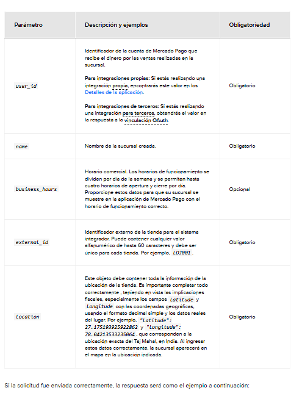
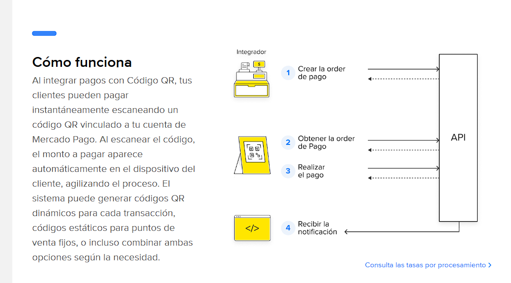

Crear sucursal
Para crear una sucursal vía API, envía un POST incluyendo tu Access Token de prueba
 al endpoint Crear sucursalAPI. Deberás añadir el user_id de la cuenta de Mercado Pago que recibirá el dinero de las transacciones en el path de tu solicitud y completar los parámetros requeridos con los detalles del negocio según lo indicado.

Es fundamental completar correctamente toda la información de ubicación de la sucursal (city_name, state_name, latitude y longitude). Los datos incorrectos pueden causar errores en los cálculos de impuestos, impactando directamente la facturación y la regularización fiscal de tu empresa.

curl -X POST \
    'https://api.mercadopago.com/users/USER_ID/stores'\
    -H 'Content-Type: application/json' \
       -H 'Authorization: Bearer ACCESS_TOKEN' \
    -d '{
  "name": "Sucursal Instore",
  "business_hours": {
    "monday": [
      {
        "open": "08:00",
        "close": "12:00"
      }
    ],
    "tuesday": [
      {
        "open": "09:00",
        "close": "18:00"
      }
    ]
  },
  "external_id": "LOJ001",
  "location": {
    "street_number": "0123",
    "street_name": "Nombre de la calle de ejemplo.",
    "city_name": "Nombre de la ciudad.",
    "state_name": "Nombre del estado.",
    "latitude": 27.175193925922862,
    "longitude": 78.04213533235064,
    "reference": "Cerca de Mercado Pago."
  }
}'

Parámetro,Descripción y ejemplos,Obligatoriedad
user_id,"Identificador de la cuenta de Mercado Pago que recibe el dinero por las ventas realizadas en la sucursal. 

Para integraciones propias: Si estás realizando una integración propia, encontrarás este valor en los Detalles de la aplicación. 

Para integraciones de terceros: Si estás realizando una integración para terceros, obtendrás el valor en la respuesta a la vinculación OAuth.",Obligatorio
name,"Nombre de la sucursal creada.",Obligatorio
business_hours,"Horario comercial. Los horarios de funcionamiento se dividen por día de la semana y se permiten hasta cuatro horarios de apertura y cierre por día. Proporcione estos datos para que su sucursal se muestre en la aplicación de Mercado Pago con el horario de funcionamiento correcto.",Opcional
external_id,"Identificador externo de la tienda para el sistema integrador. Puede contener cualquier valor alfanumérico de hasta 60 caracteres y debe ser único para cada tienda. Por ejemplo, LOJ001.",Obligatorio
location,"Este objeto debe contener toda la información de la ubicación de la tienda. Es importante completar todo correctamente, teniendo en vista las implicaciones fiscales, especialmente los campos latitude y longitude con las coordenadas geográficas, usando el formato decimal simple y los datos reales del lugar. Por ejemplo, ""latitude"": 27.175193925922862 y ""longitude"": 78.04213533235064, que corresponden a la ubicación exacta del Taj Mahal, en India. Al ingresar estos datos correctamente, la sucursal aparecerá en el mapa en la ubicación indicada.",Obligatorio

Si la solicitud fue enviada correctamente, la respuesta será como el ejemplo a continuación:
{
  "id": 1234567,
  "name": "Sucursal Instore",
  "date_created": "2019-08-08T19:29:45.019Z",
  "business_hours": {
    "monday": [
      {
        "open": "08:00",
        "close": "12:00"
      }
    ],
    "tuesday": [
      {
        "open": "09:00",
        "close": "18:00"
      }
    ]
  },
  "location": {
    "address_line": "Nombre de la calle de ejemplo, 0123, Nombre de la ciudad, Nombre del estado.",
    "latitude": 27.175193925922862,
    "longitude": 78.04213533235064,
    "reference": "Cerca de Mercado Pago"
  },
  "external_id": "LOJ001"
}
Además de los datos enviados en la solicitud, el endpoint devolverá el identificador asignado a la tienda por Mercado Pago bajo el parámetro id.

Crear caja
Para habilitar ventas con Mercado Pago, es indispensable que cada tienda registrada tenga al menos una caja vinculada. Para crear una caja y asociarla a la tienda previamente creada, envía un POST incluyendo tu Access Token de prueba
 al endpoint Crear cajaAPI como se muestra a continuación.

curl -X POST \
    'https://api.mercadopago.com/pos'\
    -H 'Content-Type: application/json' \
       -H 'Authorization: Bearer ACCESS_TOKEN' \
    -d '{
  "name": "First POS",
  "fixed_amount": true,
  "store_id": 1234567,
  "external_store_id": "LOJ001",
  "external_id": "LOJ001POS001",
  "category": 621102
}'

Parámetro,Descripción y ejemplos,Obligatoriedad
name,"Nombre de la caja creada.",Obligatorio
fixed_amount,"Este campo determina si el cliente puede ingresar el importe a pagar o si ya es prefijado por el vendedor. Para modelos integrados, este valor debe ser igual a true.",Obligatorio
store_id,"Identificador de la tienda a la que pertenece la caja, asignado a esa tienda por Mercado Pago. Es devuelto en la respuesta a la creación de la tienda bajo el parámetro id.",Obligatorio
external_store_id,"Identificador externo único de la tienda. Este valor es definido por el integrador al crear la tienda, bajo el parámetro external_id.",Obligatorio
external_id,"Identificador único de la caja definido por el sistema integrador. Debe ser un valor alfanumérico único para cada caja y puede contener hasta 40 caracteres.",Obligatorio
category,"Código MCC que indica la categoría del punto de venta. Las únicas categorías posibles son Gastronomía y Estación de servicio, y el código varía según el país de operación. Si no se especifica, permanece como una categoría genérica. Para más información sobre los códigos, consulta la Referencia de APIAPI.",Opcional

Si la solicitud fue enviada correctamente, la respuesta será como el ejemplo a continuación:
{
  "id": 2711382,
  "qr": {
    "image": "https://www.mercadopago.com/instore/merchant/qr/2711382/0977011a027c4b4387e52069da4264deae2946af4dcc44ee98a8f1dbb376c8a1.png",
    "template_document": "https://www.mercadopago.com/instore/merchant/qr/2711382/template_0977011a027c4b4387e52069da4264deae2946af4dcc44ee98a8f1dbb376c8a1.pdf",
    "template_image": "https://www.mercadopago.com/instore/merchant/qr/2711382/template_0977011a027c4b4387e52069da4264deae2946af4dcc44ee98a8f1dbb376c8a1.png"
  },
  "status": "active",
  "date_created": "2019-08-22T14:11:12.000Z",
  "date_last_updated": "2019-08-25T15:16:12.000Z",
  "uuid": "0977011a027c4b4387e52069da4264deae2946af4dcc44ee98a8f1dbb376c8a1",
  "user_id": 446566691,
  "name": "First POS",
  "fixed_amount": false,
  "category": 621102,
  "store_id": 1234567,
  "external_store_id": "SUC001",
  "external_id": "SUC001POS001"
}

Consulta en la tabla a continuación la descripción de algunos de los parámetros retornados que pueden ser útiles para continuar con tu integración más adelante.

Parámetro,Descripción
id,"ID de creación del punto de venta. Al registrar un punto de venta, recibirás un ID correspondiente. Ese ID puede utilizarse para varias operaciones, incluyendo consultar sus datos."
qr,"Código QR estático asociado a la caja creada automáticamente para recibir los pagos del punto de venta. Este código QR es necesario para el procesamiento de pagos cuando las orders son creadas en modo estático (static) o híbrido (hybrid). El objeto qr contiene los siguientes atributos: 
image: URL de la imagen del código QR a ser utilizado para recibir pagos. 
template_document: URL del archivo (en formato PDF) del template con el código QR a ser utilizado para recibir pagos. 
template_image: URL del archivo (en formato de imagen) del template con el código QR a ser utilizado para recibir pagos."
status,"Estado de creación del punto de venta."
uuid,"El UUID (Universally Unique Identifier - Identificador Universalmente Único) es un número de 128 bits utilizado para identificar información. En este caso, es el número de identificación del Código QR en cuestión."
user_id,"Identificador de la cuenta de Mercado Pago que recibe el dinero por las ventas realizadas en la caja."
name,"Nombre asignado a la caja en el momento de su creación."
store_id,"Identificador de la tienda a la que pertenece el punto de venta."
external_store_id,"Identificador externo de la tienda, que fue asignado por el sistema integrador en el momento de su creación bajo el parámetro external_id."
external_id,"Identificador único de la caja definido por el sistema integrador. Si ambas solicitudes son exitosas, habrás creado y configurado la tienda y la caja necesarias para la integración con Código QR."

Con la tienda y la caja creadas, podrás integrar el procesamiento de pagos.

Integrar el procesamiento de pagos
El procesamiento de pagos con código QR se realiza mediante la creación de orders que incluyen una transacción de pago asociada. Al crear una order, el comprador podrá realizar el pago de forma presencial escaneando el código.

Existen tres modelos de Código QR disponibles para integración, definidos en el momento de la creación de la order:

Modelo estático: En este modelo, un único código QR asociado a la caja creada previamente recibe la información de cada order generada.
Modelo dinámico: Un código QR exclusivo y de pago único es generado para cada transacción, conteniendo los datos específicos de la order creada.
Modelo híbrido: Permite que el pago se realice tanto por el QR estático como por el dinámico. La order se vincula al código QR estático de la caja, mientras que también se genera un QR dinámico simultáneamente. Una vez que se realice el pago con cualquiera de los dos códigos, el otro quedará automáticamente inhabilitado para su uso.
Esta integración permite crear, procesar y cancelar orders, además de realizar reembolsos y consultar información y actualizaciones de estado de las transacciones.

Al crear una order especificando el campo config.qr.mode como static, el QR que deberá ser escaneado por el cliente es el obtenido en la respuesta a la solicitud de creación de la caja, pues es el que recibirá la información de la order creada. Si la solicitud es exitosa, la respuesta devolverá una order con status created.

Consulta debajo un ejemplo de respuesta para una solicitud de creación de una order para pagos con código QR estático.

Durante el desarrollo de la integración, es posible escanear los códigos QR generados utilizando la aplicación de Mercado Pago, accediendo con una cuenta de prueba de vendedor. Para más información, consulta la documentación Probar la integración.

{
   "id": "ORD01K371WBFDS4MD9JG0K8ZMECBE",
   "type": "qr",
   "processing_mode": "automatic",
   "external_reference": "ext_ref_1234",
   "description": "Smartphone",
   "total_amount": "50.00",
   "expiration_time": "PT16M",
   "country_code": "ARG",
   "user_id": "{{USER_ID}}",
   "status": "created",
   "status_detail": "created",
   "currency": "ARS",
   "created_date": "2025-08-21T19:32:21.621Z",
   "last_updated_date": "2025-08-21T19:32:21.621Z",
   "integration_data": {
       "application_id": "{{APPLICATION_ID}}"
   },
   "transactions": {
       "payments": [
           {
               "id": "PAY01K371WBFDS4MD9JG0KCV6PRKQ",
               "amount": "50.00",
               "status": "created",
               "status_detail": "ready_to_process"
           }
       ]
   },
   "config": {
       "qr": {
           "external_pos_id": "STORE001POS001",
           "mode": "static"
       }
   },
   "items": [
       {
           "title": "Smartphone",
           "unit_price": "50.00",
           "unit_measure": "kg",
           "external_code": "777489134",
           "quantity": 1,
           "external_categories": [
               {
                   "id": "device"
               }
           ]
       }
   ],
   "discounts": {
       "payment_methods": [
           {
               "type": "account_money",
               "new_total_amount": "47.28"
           }
       ]
   }
}

Store and POS Response successful:
{
    "store": {
        "id": "71238321",
        "name": "Mi Tienda Nueva",
        "date_creation": "2025-10-31T16:09:36.615Z",
        "location": {
            "address_line": "Otra Calle 1235, La Plata, Buenos Aires, Argentina",
            "latitude": -34.9206,
            "longitude": -57.9537,
            "id": "TUxBQ0xBUGxhdGE",
            "type": "city",
            "city": "La Plata",
            "state_id": "AR-B"
        },
        "external_id": "STOREFAKA"
    },
    "pos": {
        "id": 120587102,
        "qr": {
            "image": "https://www.mercadopago.com/instore/merchant/qr/120587102/7d52cdadeb4a4a60bd448328f25078c378142ca93bd54d499d4b0debe0bc029e.png",
            "template_document": "https://www.mercadopago.com/instore/merchant/qr/120587102/template_7d52cdadeb4a4a60bd448328f25078c378142ca93bd54d499d4b0debe0bc029e.pdf",
            "template_image": "https://www.mercadopago.com/instore/merchant/qr/120587102/template_7d52cdadeb4a4a60bd448328f25078c378142ca93bd54d499d4b0debe0bc029e.png"
        },
        "status": "active",
        "date_created": "2025-10-31T16:09:38.000-04:00",
        "date_last_updated": "2025-10-31T16:09:38.000-04:00",
        "uuid": "7d52cdadeb4a4a60bd448328f25078c378142ca93bd54d499d4b0debe0bc029e",
        "user_id": 495852790,
        "name": "POS Mi Tienda Nueva",
        "fixed_amount": true,
        "category": 621102,
        "store_id": "71238321",
        "external_id": "STOREFAKAPOS001",
        "site": "MLA",
        "qr_code": "00020101021143540016com.mercadolibre0130https://mpago.la/pos/12058710250150011204565646835204970053030325802AR5915Lisandro Arenas6004CABA63042C9B"
    }
}

Orders:
{
    "id": "ORD01K8XQXAC5F2HA56BWPN4ZJ53G",
    "type": "qr",
    "processing_mode": "automatic",
    "external_reference": "TEST-001",
    "description": "Test Order from Mi Tienda Nueva",
    "total_amount": "1000.00",
    "expiration_time": "PT16M",
    "country_code": "ARG",
    "user_id": "495852790",
    "status": "created",
    "status_detail": "created",
    "currency": "ARS",
    "created_date": "2025-10-31T18:19:08.684Z",
    "last_updated_date": "2025-10-31T18:19:08.684Z",
    "integration_data": {
        "application_id": "907286131156759"
    },
    "transactions": {
        "payments": [
            {
                "id": "PAY01K8XQXAC5F2HA56BWPPZA1AH7",
                "amount": "1000.00",
                "status": "created",
                "status_detail": "ready_to_process"
            }
        ]
    },
    "config": {
        "qr": {
            "external_pos_id": "STOREFAKAPOS001",
            "mode": "static"
        }
    },
    "items": [
        {
            "title": "Test Product",
            "unit_price": "1000.00",
            "unit_measure": "unit",
            "external_code": "TEST-ITEM-001",
            "quantity": 1
        }
    ]
}